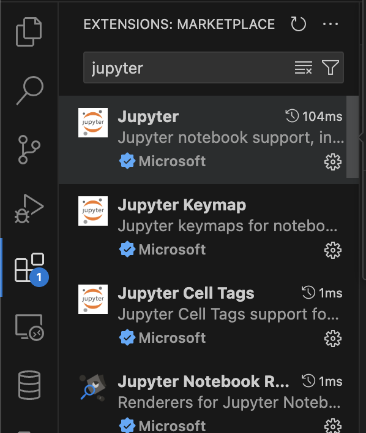
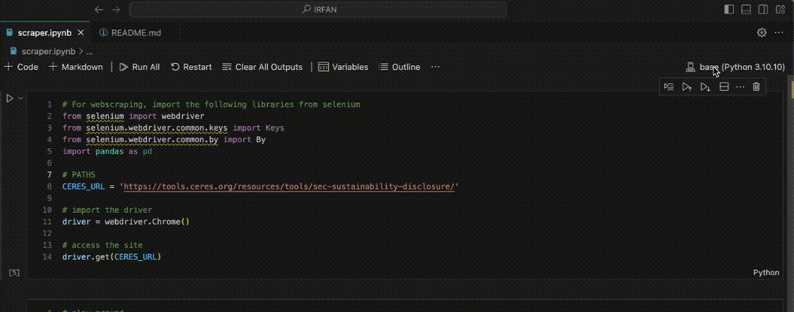

# Sustainability Report Scrapping
### SEC Sustainability Disclosure Search
This code scrapes data from various companies and analyzes the correlation of a company's use of various words in their report against how sustainable they really are.

## TOOLS USED / PREREQUISITES
- <a href="https://docs.anaconda.com/free/miniconda/miniconda-install/">Miniconda</a> (Conda) for python environments with the necessary libraries/packages
- <a href="https://code.visualstudio.com/download">Visual Studio Code</a> (IDE to write/run code)
- Selenium (Library for webscrapping)
- Basic python libraries

## Get started 
### 1. Create your environment
With miniconda installed, in your cmd/terminal, cd to the path you want to create your environment in.

Once done, create python environment using the following command:\
`conda create --prefix=[NameOfEnvironemnt] python=3.11.9`

Replace `[NameOfEnvironemnt]` to the environment name you want, for example:\
`conda create --prefix=FYP python=3.11.8`

Once that's done, follow the instructions to activate the environment:\
`conda activate /path/to/your/env`

### 2. Install necessary libraries
While in the directory of this project (with requirements.txt), run the following command to install all the necessary libraries:\
`pip install -r requirements.txt`

### 3. Running the Selenium webscrapping bot using Visual Studio Code (VSC)
Before running the code, make sure to have the necessary extensions needed for Visual Studio Code by doing the following:\

#### 1. Install Jupyter extension on VSC:
From the left hand side tabs, click extension (icon with 4 boxes), search 'jupyter', and install. This will allow you to open/run jupyter notebook files (.ipynb) on VSC.

 

#### 2. Prepare the Environments needed for the scrapping:

1) Open scraper.ipynb
2) On the top right, select the environemnt
3) In the pop up, click 'Python Environments...'
4) Select the environment you created earlier 

#### 3. Run
- Click on 'Run All' in the bar of buttons in the file scraper.ipynb

